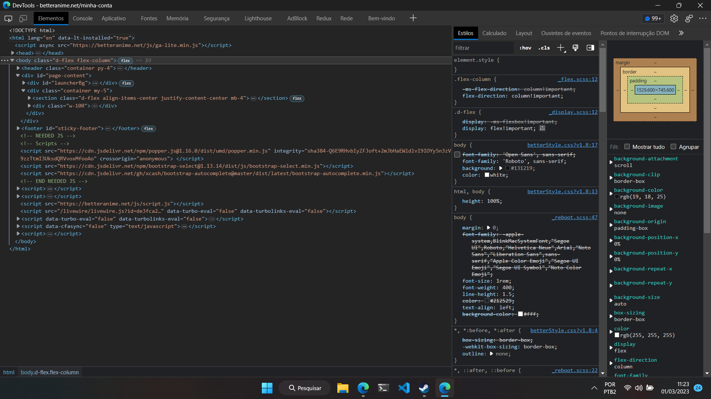
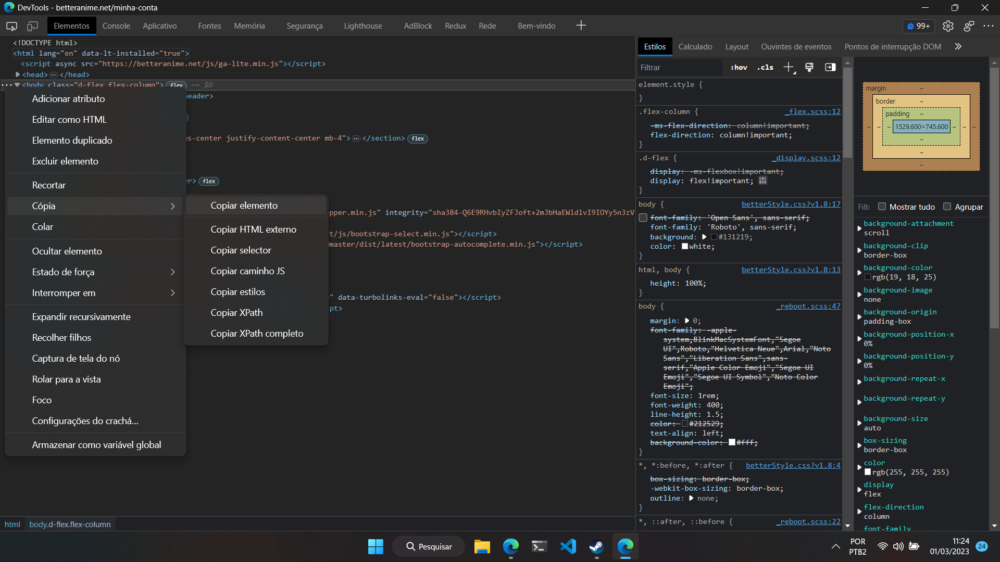

<h1 align="center">Favorite Anime Scraping</h1>

## Descrição
Favorite Anime Scraping, surgiu de um desejo meu de recuperar minha lista de animes, que está em um site onde costumava assisti-los. Por acreditar que outras pessoas poderiam ter o mesmo desejo, decidi compartilhar, criando um arquivo executável(.exe) para facilitar seu uso. O programa consegue obter o nome do anime, a URL de sua capa e até mesmo baixar a capa caso o usuário deseje.

## Tecnologias
* [Python](https://www.python.org/)
* [Requests](https://requests.readthedocs.io/en/latest/)
* [Beautiful Soup](https://www.crummy.com/software/BeautifulSoup/bs4/doc.ptbr/)
* [Pyinstaller](https://pyinstaller.org/en/stable/)

Todo o projeto foi desenvolvido em **Python**, para garantir um ambiente isolado para o desenvolvimento e reduzir complexidade na conversão para .exe, utilizar o **venv**. O processo de raspagem foi feito com o **Beautiful Soup**, mapeado e filtrando os dos do html. Quanto a download de imagens foi usado o **Requests**. A conversão do código-fonte para executável foi feita através do **Pyinstaller**.

## Utilização
1. Baixe o executável do arquivo executável ([Download](https://github.com/JeffersonSimplicio/scraping-favorite-anime/raw/main/animeScraping.exe))

2. Faça login do Better Anime e navegue até a [página de perfil](https://betteranime.net/minha-conta)

3. Clique com o botão direito o mouse e depois em Inspecionar ou pressione F12 em seu teclado

4. Uma tecla semelhante a esta surgira, clique em body e nos 3(três) pontos que surgirão a esquerda, conforme a imagem a baixo

5. Clique em `Cópia` e em seguida `Copiar elemento`

6. Abra o editor de texto que sua preferência, cole o código e salve o arquivo com a extensão `.html`
- ✨ **Dica:** Recomendo que o executável e o HTML figuem na mesma pasta, esse é o local padrão onde um programa buscara o arquivo do site
- ✨ **Dica:** O arquivo pode ser salvo com qualquer nome, mas recomendo que salve como `favorites-list-page.html`, esse é o nome padrão que o programa usa

7. Abra o programa

8. Caso tenha seguido as dicas dadas anteriormente, basta clicar Enter; do contrário sera necessário informar a rota até o html

9.  O programa lhe dará 4(quatro) opções, escolha uma delas, digite o número e pressione Enter. Você pode usar o programa quantas vezes quiser e testar cada opção

## O que cada opção faz
 - `1 - Lista de nomes(txt)`: Gera um arquivo como o nome *FavoritesAnimes.txt*, com o nome de todos os animes favoritados no site
 - `2 - Lista com nome e URL da thunb(txt)`: Gera um arquivo como o nome *FavoritesAnimes.txt*, com o nome de todos os animes favoritados no site e ao lado do nome a URL para sua capa
 - `3 - Lista com nome e URL da thunb(json)`: Gera um arquivo como o nome *FavoritesAnimes.json*, com uma lista de objetos contendo nome e URL da capa
 - `4 - Lista com nome e path da thumb(download da thunb)(json)`: Gera um arquivo como o nome *FavoritesAnimes.json* e também uma pasta *thunbs*, na pasta esta todas as capas dos animes favoritados, no .json está uma lista de objetos contendo nome e o path para capa na pasta thunbs

## Respondendo algumas duvidas

  
<strong>O programa funciona apenas no Better Anime?</strong>

  Sim. Seu devolvimento foi feito baseado-se na árvore DOM do Better Anime. Não sendo testando com nenhum outro site.

  
<strong>Por que programa não faz a raspagem direto na web?</strong>

  Essa funcionalidade também está em meus planos. Entretanto, o site usa reCaptcha dificultando tal tarefa.

  
<strong>É possível utilizar o programa também no Linux?</strong>

  Sim. Por enquanto um modo simples de usar se limita ao Windows, para usar o programa no Linux, é necessário usá-lo a partir do código-fonte diretamente. Pretendo adiciona este modo de uso futuramente.

